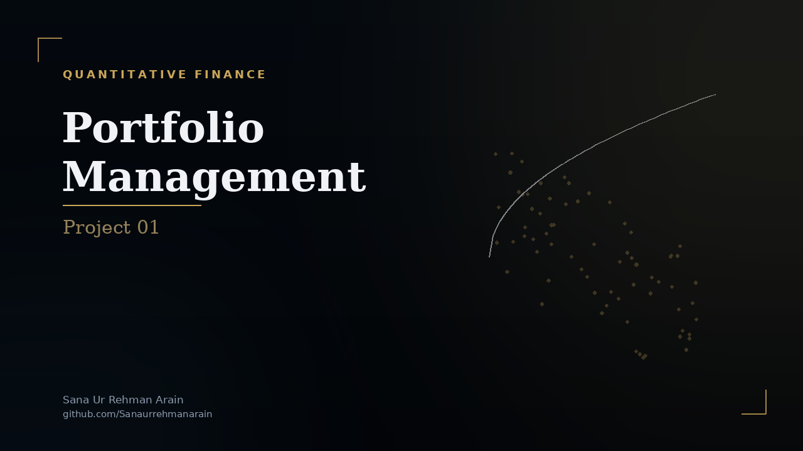

  
  
<em>Click the banner to view the full analysis report</em>

# Quantitative Portfolio Optimization & Factor Analysis

## Overview
This repository contains a comprehensive, end-to-end quantitative portfolio management project. It explores advanced asset allocation techniques, transitioning from traditional Modern Portfolio Theory (MPT) to factor-based risk analysis, Monte Carlo simulation boundaries, and finally, the implementation of the Black-Litterman model to incorporate subjective market views.

## Project Architecture
The analysis is structured into four core phases, coded entirely in Python using Jupyter Notebooks:

### 1. Mean-Variance Optimization (MVO)
Calculates the optimal asset weights for a 10-stock universe (TSLA, WMT, BAC, GS, LLY, MRK, GOOG, META, AAPL, XOM) by maximizing the Sharpe ratio.
* Evaluates the mathematical impact of unconstrained vs. constrained (18% maximum weight) capital allocation.
* Visualizes the nested Efficient Frontiers.
* Conducts strict **Out-of-Sample testing** to demonstrate the dangers of overfitting and the real-world value of diversification constraints (evaluating Cumulative Returns, Sharpe Ratios, and Max Drawdown).

### 2. Fama-French 5-Factor Style Analysis
Deconstructs the constrained portfolio's historical returns to determine its underlying investment style.
* Extracts daily Fama-French data (Mkt-RF, SMB, HML, RMW, CMA) using pandas-datareader.
* Compares Ordinary Least Squares (OLS) with Huber's T Robust Linear Regression to account for fat-tailed market anomalies.
* Validates the regression model's predictive power on unseen Out-of-Sample data.

### 3. Hard Optimization vs. Monte Carlo Simulations
Investigates the computational efficiency and mathematical limitations of random simulation.
* Processes hundreds of thousands of simulated portfolios to map the feasible region of risk/return.
* Demonstrates the "Curse of Dimensionality" and high rejection rates when applying strict box constraints to random sampling compared to SLSQP algorithmic optimization.

### 4. The Black-Litterman Model
Resolves the estimation-error maximization problem inherent in traditional Markowitz optimization by blending market equilibrium with subjective manager views.
* Constructs a synthetic market composite using the S&P 500 (SPY).
* Translates absolute and relative market views into matrix algebra ($P$ and $Q$ matrices).
* Calculates posterior expected returns ($\mu_{BL}$) and covariance ($\Sigma_{BL}$) to output a balanced, intuitive asset allocation.

## Technologies & Libraries
* **Python 3.x**
* `yfinance` (Data Acquisition)
* `pandas`, `numpy` (Data Wrangling & Matrix Algebra)
* `scipy.optimize` (SLSQP Optimization)
* `statsmodels` (OLS & Robust Factor Regressions)
* `matplotlib` (Data Visualization)

## Repository Structure
* `notebooks/` - Contains the primary Jupyter Notebooks with all execution code.
* `TASKS.md` - A detailed breakdown of the original project requirements and constraints.
* `requirements.txt` - Dependency list for environment replication.

## Citation

If you use this project in academic research, publications, educational
materials, or derivative works, please cite the project.

This repository includes a `CITATION.cff` file, so GitHub provides a
**"Cite this repository"** button in the repository sidebar. You can use it
to obtain citations in BibTeX, APA, and other supported formats.

**Suggested citation:**

Arain, S. U. R. (2026). quant-portfolio-optimization (Version 1.0) [Software].
<https://github.com/sanaurrehmanarain/quant-portfolio-optimization>

**Author:** Sana Ur Rehman Arain

**Profession:** Data Scientist

**GitHub:** <https://github.com/sanaurrehmanarain>

**Contact:** <sana.arain.work@gmail.com>

If you build upon this work, attribution is appreciated and helps others
discover the original project.

> **Note:** The MIT License requires that the original copyright
> notice be retained in copies of the Software.

---

## License

This project is licensed under the MIT License. See the
[LICENSE](LICENSE) file for details.
